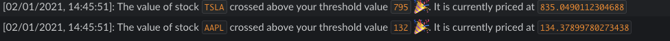

# Stonks Notify
Recieve Slack notifications when the value of a stock crosses a threshold. 



# Dependencies
- [yfinance](https://github.com/ranaroussi/yfinance)

# Steps
- Create a Slack app and obtain its [webhook url](https://api.slack.com/messaging/webhooks#create_a_webhook)
- Add the url to the stonks.yaml file
- Add details of stock you want to track in [stonks.yaml](stonks.yaml)
    - You will recieve a slack notification when the value of the stock crosses the high or low value provided in stonks.yaml
    - Update frequency determines how frequently you recieve a notification when a stock crosses the threshold. A low value will flood your notification. 
- Run the code using the following python command
```bash
python stonk_notify.py --config_path <path to yaml file>
```